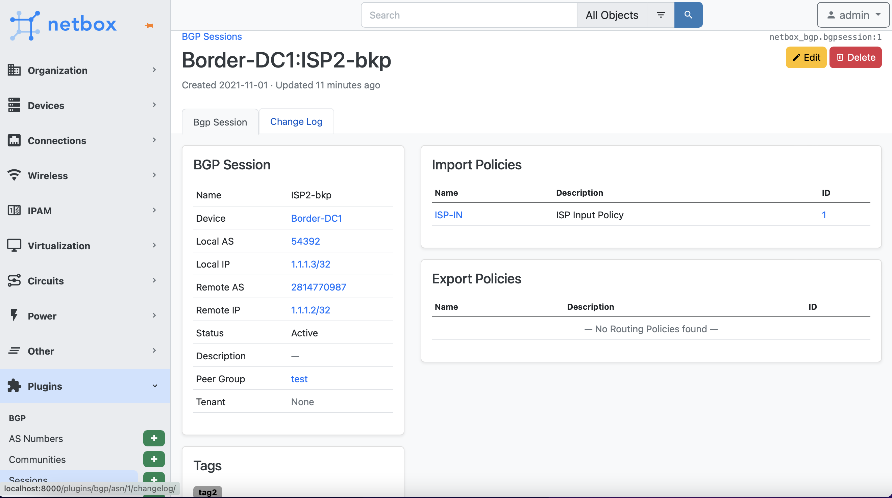
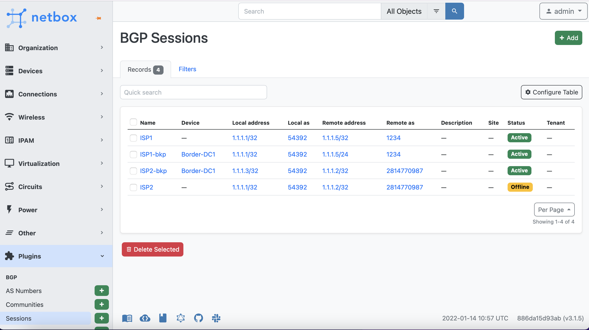
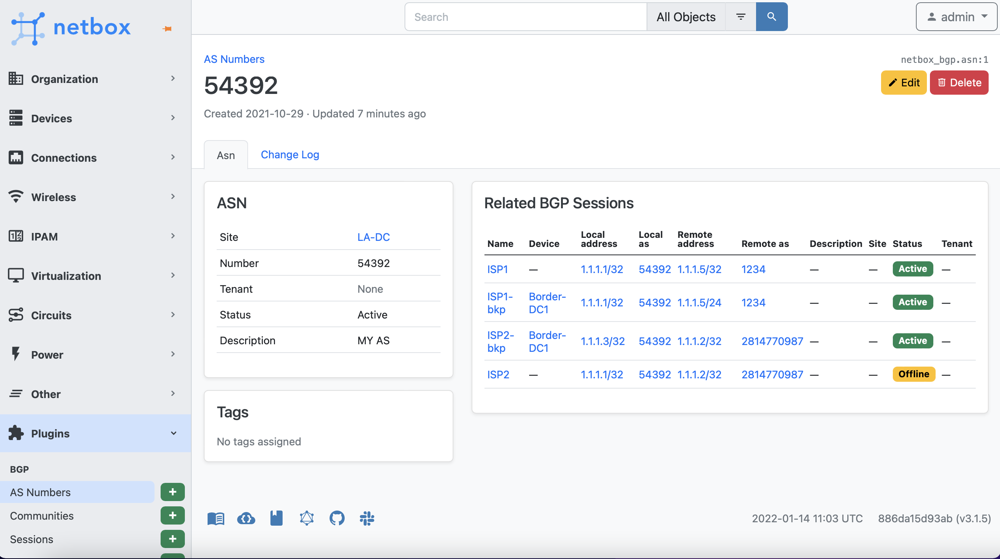
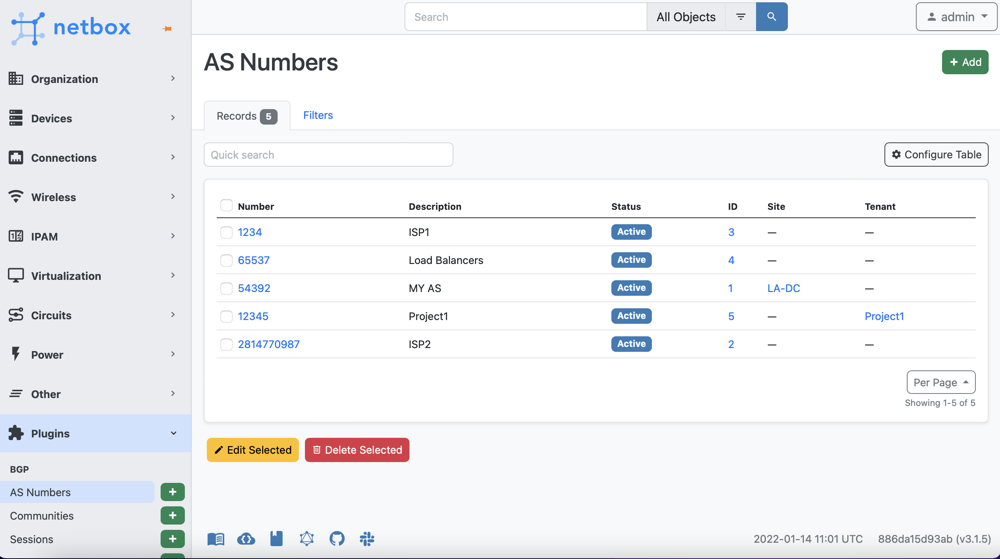

# NetBox BGP Plugin
[Netbox](https://github.com/netbox-community/netbox) plugin for BGP related objects documentation.

## Features
This plugin provide following Models:
* AS Numbers (will be removed in 0.8.0)
* BGP Communities
* BGP Sessions
* Routing Policy
* Prefix Lists (new in 0.7.0)

## Compatibility

|             |       |
|-------------|-------|
| NetBox 2.10 | 0.3.9 |
| NetBox 2.11 | 0.3.9 |
| NetBox 3.0  | 0.4.3 |
| NetBox 3.1  | 0.5.0 |
| NetBox 3.2  | 0.6.0 |

## Installation

The plugin is available as a Python package in pypi and can be installed with pip  

```
pip install netbox-bgp
```
Enable the plugin in /opt/netbox/netbox/netbox/configuration.py:
```
PLUGINS = ['netbox_bgp']
```
Restart NetBox and add `netbox-bgp` to your local_requirements.txt

## Configuration

The following options are available:
* `device_ext_page`: String (default right) Device related BGP sessions table position. The following values are available:  
left, right, full_width. Set empty value for disable.   
* `asdot`: Boolean (defaul False) asdot notation for 4-byte AS

## Screenshots

BGP Session


BGP Sessions


ASN


ASNs


Community


Peer Group

