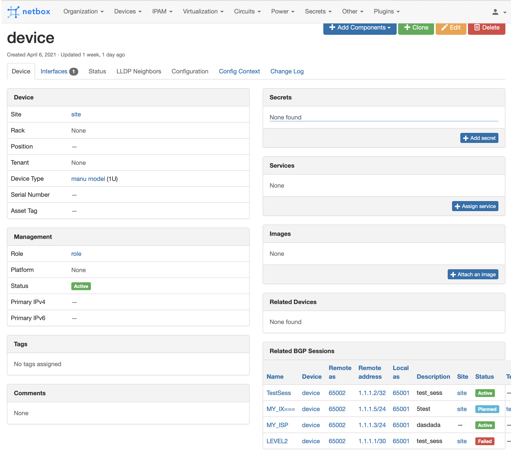

# Netbox BGP Plugin
[Netbox](https://github.com/netbox-community/netbox) plugin for BGP related objects documentation.

## Compatibility

This plugin in compatible with [NetBox](https://netbox.readthedocs.org/) 2.10 and later.

## Installation

The plugin is available as a Python package in pypi and can be installed with pip

```
pip install netbox-bgp
```
Enable the plugin in /opt/netbox/netbox/netbox/configuration.py:
```
PLUGINS = ['netbox_bgp']
```
Restart NetBox and add `netbox-bgp` to your local_requirements.txt

## Configuration

The following options are available:
* `device_ext_page`: String (default right) Device related BGP sessions table position. The following values are available:  
left, right, full_width. Set empty value for disable.

## Screenshots

BGP Session Object


BGP Session Table


Device Extension


ASN Object


ASN Table


Community Object
