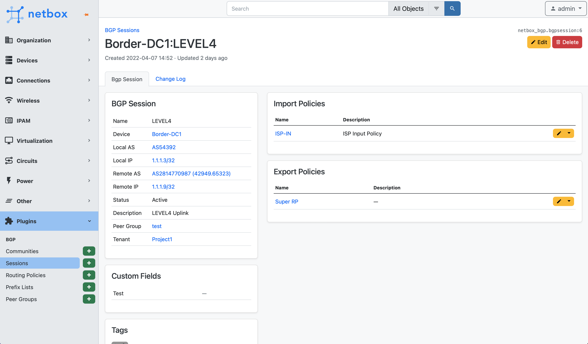
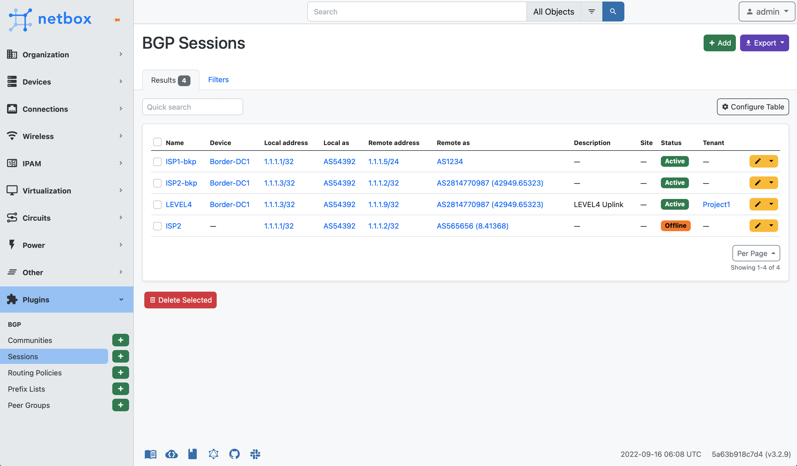
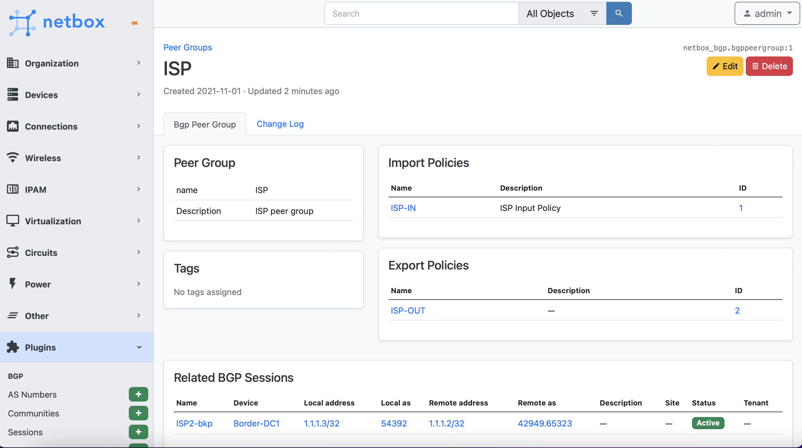
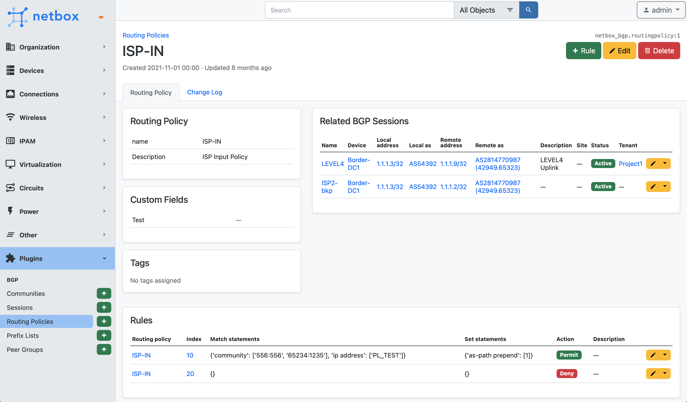
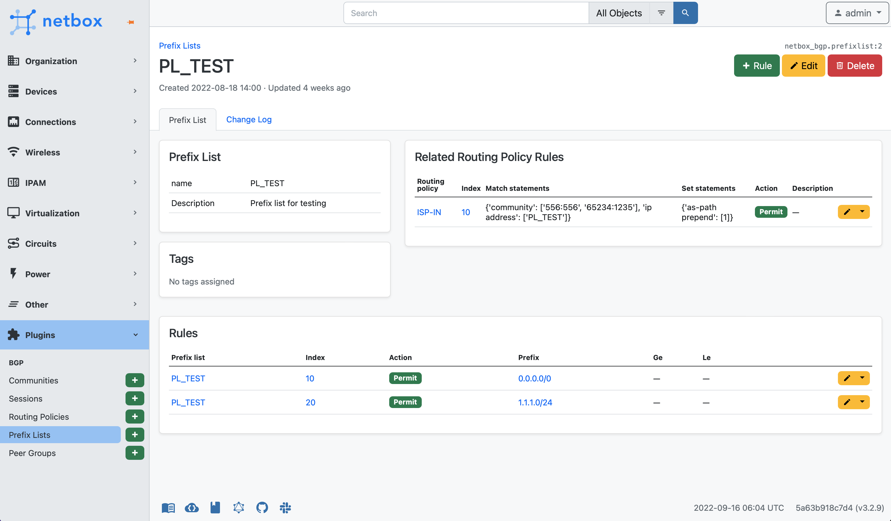

# NetBox BGP Plugin
[Netbox](https://github.com/netbox-community/netbox) plugin for BGP related objects documentation.

## Features
This plugin provide following Models:
* BGP Communities
* BGP Sessions
* Routing Policy
* Prefix Lists 

## Compatibility

|             |           |
|-------------|-----------|
| NetBox 3.4  | >= 0.9.0  |
| NetBox 3.5  | >= 0.10.0 |
| NetBox 3.6  | >= 0.11.0 |
| NetBox 3.7  | >= 0.12.0 |

## Installation

The plugin is available as a Python package in pypi and can be installed with pip  

```
pip install netbox-bgp
```
Enable the plugin in /opt/netbox/netbox/netbox/configuration.py:
```
PLUGINS = ['netbox_bgp']
```
Restart NetBox and add `netbox-bgp` to your local_requirements.txt

See [NetBox Documentation](https://docs.netbox.dev/en/stable/plugins/#installing-plugins) for details

## Configuration

The following options are available:
* `device_ext_page`: String (default right) Device related BGP sessions table position. The following values are available:  
left, right, full_width. Set empty value for disable.
* `top_level_menu`: Bool (default False) Enable top level section navigation menu for the plugin. 

## Screenshots

BGP Session


BGP Sessions


Community


Peer Group


Routing Policy


Prefix List

