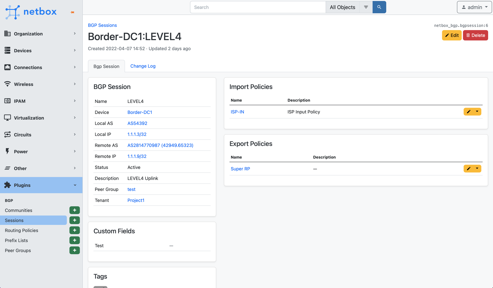
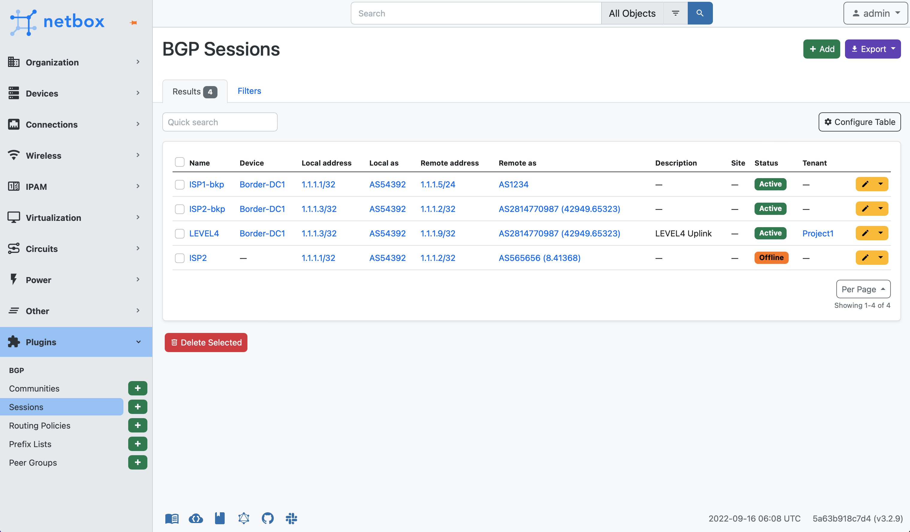
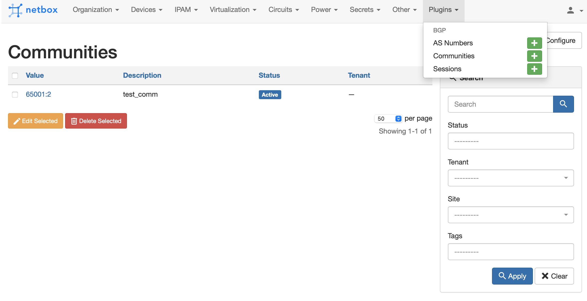
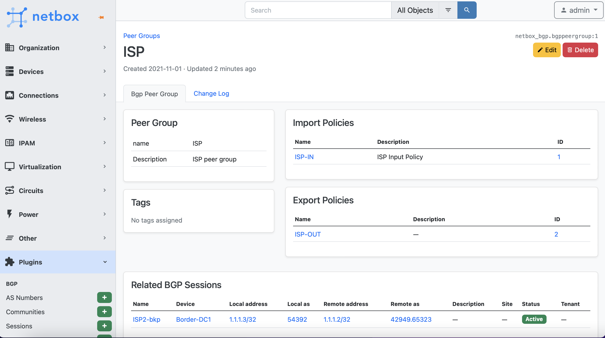
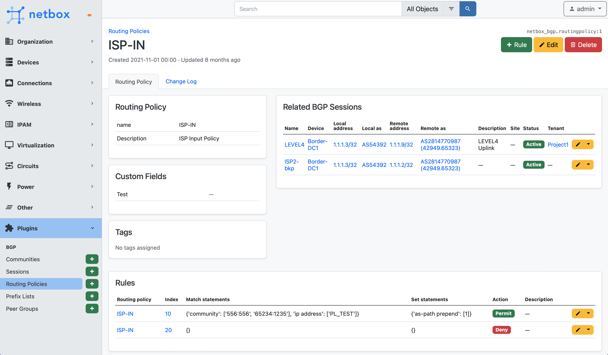
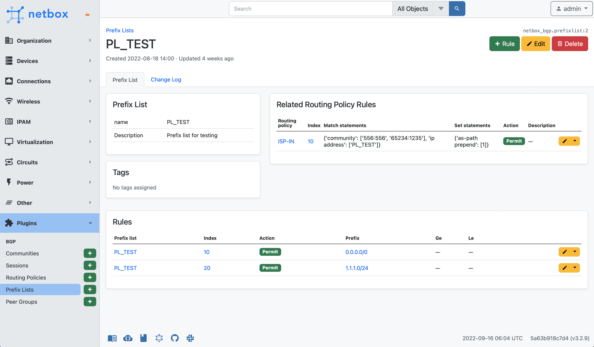

# NetBox BGP Plugin

This [Netbox](http://netboxlabs.com/oss/netbox/) plugin introduces support for BGP related objects documentation.

Models include:

* BGP Communities
* BGP Sessions
* BGP Peer Groups
* Routing Policy
* Prefix Lists
* AS Path Lists

## Compatibility

See the [compatibility matrix](COMPATIBILITY.md) for supported NetBox versions.

## Installation

The plugin is available as a Python package in pypi and can be installed with pip

```
pip install netbox-bgp
```
Enable the plugin in /opt/netbox/netbox/netbox/configuration.py:
```
PLUGINS = ['netbox_bgp']
```
Restart NetBox and add `netbox-bgp` to your local_requirements.txt

See [NetBox Documentation](https://docs.netbox.dev/en/stable/plugins/#installing-plugins) for details

## Configuration

The following options are available:
* `device_ext_page`: String (default right) Device related BGP sessions display mode. The following values are available:
  - `left`: Display BGP sessions in the left column of the device detail page
  - `right`: Display BGP sessions in the right column of the device detail page
  - `full_width`: Display BGP sessions in full width at the bottom of the device detail page
  - `tab`: Display BGP sessions in a dedicated tab on the device detail page
  - Set empty value to disable device BGP sessions display
* `top_level_menu`: Bool (default False) Enable top level section navigation menu for the plugin.
* `REMOTE_ADDRESS_STRICT`: Bool (default False) When enabled, the "Add Session" form requires selecting an existing IPAddress object for Remote Address instead of accepting a free-text CIDR (which would otherwise auto-create a new IPAddress). Recommended for multi-VRF environments to avoid orphaned addresses and ambiguous matches.

## Screenshots

BGP Session


BGP Sessions


Community


Peer Group


Routing Policy


Prefix List

